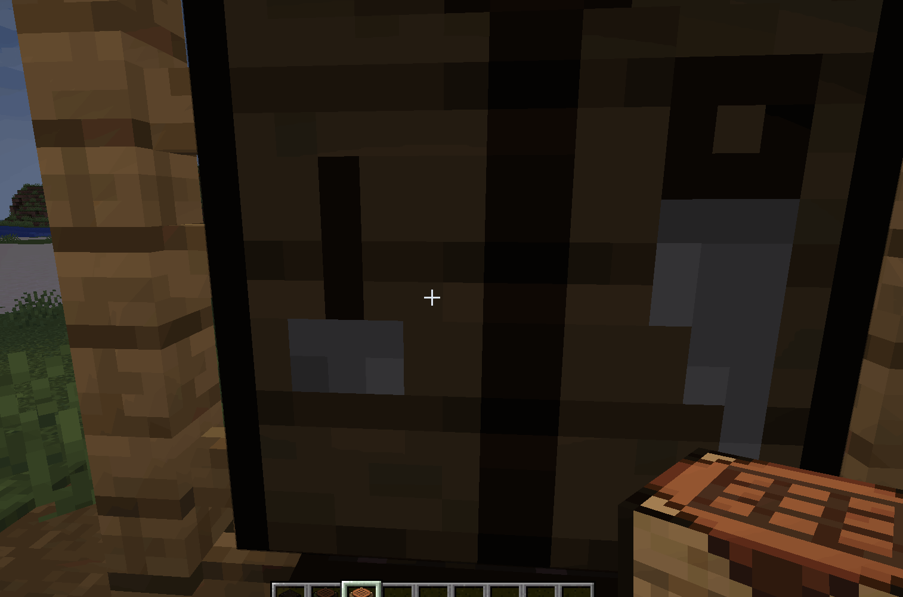

# Crafting Network



A Minecraft 1.21.1 mod for **NeoForge** and **Fabric** that adds a **Crafting Station** — an upgradable crafting table that scans nearby chunks for storage containers and lets you craft using items pulled from those containers and your own inventory.

> Currently in development. Tested in single-player and on LAN/dedicated servers.

## Features

- **Crafting Station block** — an upgradable crafting table that opens the familiar vanilla crafting window.
- **Vanilla recipe book** — fully supported; craftable/uncraftable highlights reflect what the station can make from the scanned network plus your inventory.
- **Network-aware craftable detection** — the station keeps a synchronized catalog of the largest stacks across the network, so recipes you currently can't craft show up greyed-out and clickable recipes are highlighted.
- **Blueprint crafting** — place a copy of each ingredient in the 3×3 grid as a template; the station crafts using items from the nearest containers **and** your inventory, without taking from the grid.
- **Click to craft** — click the result slot to craft one (or shift-click for a full stack); keep clicking to keep crafting as long as ingredients hold out.
- **Shift-click deposit** — shift-click items in your inventory to push them into the scanned containers.
- **Source dropdown** — a floating dropdown beside the GUI selects **All Storage** or a single container; crafting, the recipe-book catalog and the storage panel all respect the selection. Drag it to reposition, scroll through the list, and its position is remembered between sessions (`config/crafting_network-client.json`).
- **Remote storage panel** — the **Storage** button above the grid toggles a 9×7 panel showing the top 63 items available in the selected source.
- **Count-accurate scanning** — duplicate handlers (e.g. both halves of a double chest or stacked backpack inventories) are deduplicated, so counts match what the storage terminal shows.
- **Range upgrades** — six tiers that expand the scan radius:
  - Tier 0 → 1×1 chunks (base) - no upgrade needed
  - Tier 1 → 3×3 chunks
  - Tier 2 → 5×5 chunks
  - Tier 3 → 7×7 chunks
  - Tier 4 → 9×9 chunks
  - Tier 5 → 11×11 chunks (max)
- **Server-aware range limits** — tiers are automatically capped so the scan radius never exceeds the server's `view-distance`/`simulation-distance` from `server.properties`, and can be further limited in a config file.
- **Fast scanning** — the station only scans actual inventory-bearing block entities, so it stays responsive even with many containers nearby.
- **Server-authoritative** — works in single-player, LAN, and dedicated servers; no client-side hacks.

## Requirements

- **Minecraft**: 1.21.1
- **NeoForge** edition: NeoForge 21.1.235 or later
- **Fabric** edition: Fabric Loader 0.16.14 or later + [Fabric API](https://modrinth.com/mod/fabric-api)

## Installation

**NeoForge edition**

1. Install [NeoForge](https://neoforged.net/) for Minecraft 1.21.1.
2. Place `neoforge-crafting_network-1.YY.MM.DD.HH.jar` from the [Releases](https://github.com/RetiredRoca/crafting-network/releases) page (NeoForge edition) into your `mods/` folder.
3. Launch the game.

**Fabric edition**

1. Install [Fabric Loader](https://fabricmc.net/use/) for Minecraft 1.21.1, plus Fabric API.
2. Place the Fabric `fabric-crafting_network-1.YY.MM.DD.HH.jar` from the [Releases](https://github.com/RetiredRoca/crafting-network/releases) page into your `mods/` folder.
3. Launch the game.

## Building from source

Requires **Java 21** (auto-provisioned by the Gradle toolchain).

**NeoForge edition** (from the `neoforge/` folder):

```bash
cd neoforge
./gradlew build
```

The built mod JAR will be at `neoforge/build/libs/neoforge-crafting_network-1.YY.MM.DD.HH.jar`.

**Fabric edition** (from the `fabric/` folder):

```bash
cd fabric
./gradlew build
```

The built mod JAR will be at `fabric/build/libs/fabric-crafting_network-1.YY.MM.DD.HH.jar`.

> Note: run `build` only. Do **not** run `runClient`/`runServer` during development if you prefer to test via a launcher (e.g. Prism Launcher) pointing at an existing installation.

## Usage

1. Craft the **Crafting Station** and place it somewhere with your storage nearby.
2. **Right-click** the station to open the crafting window.
3. Click items from your inventory into the 3×3 grid to set up the recipe template (your items stay in your inventory).
4. Use the **source dropdown** beside the window to craft from **All Storage** or a single container; drag it to move it around the screen.
5. **Click the result slot** to craft one, holding items in your cursor; **shift-click** the result to craft a full stack.
6. Open the **recipe book** to browse recipes — craftable ones are highlighted based on the storage network.
7. Click the **Storage** button to toggle a panel showing the top items in the selected source, and **shift-click** items from your own inventory to deposit them into the network.
8. Craft and apply a **Range Upgrade** (right-click it on the station) to increase scan range.

> Crafting always prefers items from the scanned containers first, then uses the player's inventory if the network runs short.

## Recipes

Recipes: `crafting_terminal` (crafting table surrounded by copper ingots) and five `crafting_upgrade_tierN` recipes (craft the station surrounded by iron/gold/emerald/diamond/netherite ingots — it must match the station's current tier). Recipe JSONs are in `neoforge/src/main/resources/data/crafting_network/recipe/` (NeoForge) and `fabric/src/main/resources/data/crafting_network/recipe/` (Fabric).

## Configuration

The max tier can be limited per server. The effective tier is also capped automatically by the smaller of the server's `view-distance` and `simulation-distance` from `server.properties`, so upgrades never scan further than chunks are actually generated/loaded.

- **NeoForge**: `config/crafting_network-server.toml` (generated on first run) — `maxTier` hard caps the highest tier that may be applied (default `5`).
- **Fabric**: `config/crafting_network.json` (generated on first run) — `maxTier` behaves the same (default `5`).

Client-side, `config/crafting_network-client.json` stores the last position of the source dropdown.

## Credits

- **Mod ID**: `crafting_network`
- **Package**: `com.retiredroca.craftingnetwork`

## License

Released under the [Apache License 2.0](LICENSE).

*NeoForge edition built with the [MDK](https://github.com/neoforged/MDK); Fabric edition built with the [Fabric Example Mod](https://github.com/FabricMC/fabric-example-mod). Minecraft, NeoForge and Fabric are property of their respective owners.*
